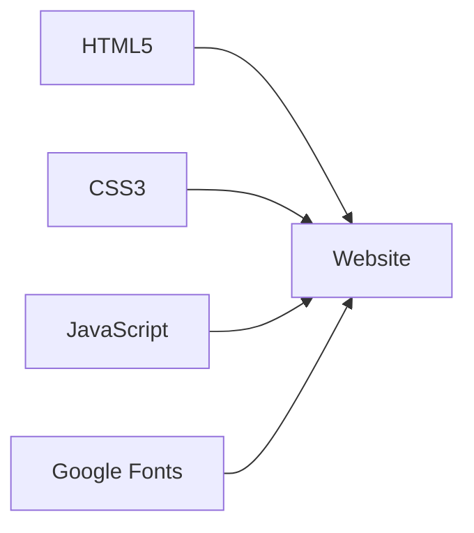

<div align="center">

# Evon Shahriar's Personal Website 🌐


[](https://choosealicense.com/licenses/mit/) [](http://monip.org/) [](https://github.com/evonshahriar)

</div>

---

<table>
<tr>
<td width="50%">

## 🚀 Features

- Responsive Design
- Project Showcase
- Publication Listings
- Weekly Research Updates
- Interactive Contact Form
- Google Maps Integration
- Site-wide Search

</td>
<td width="50%">

## 💻 Tech Stack



</td>
</tr>
</table>

---

<details>
<summary><strong>📂 Project Structure</strong></summary>

```
personal-website/
├── 📄 index.html
├── 📄 about.html
├── 📄 projects.html
├── 📄 publications.html
├── 📄 journal.html
├── 📄 contact.html
├── 🎨 styles.css
└── 🔧 common.js
```

</details>

---

## 🚀 Quick Start

```bash
git clone https://github.com/evonshahriar/personal-website.git && cd personal-website && open index.html
```

---

<table>
<tr>
<td width="50%">

## 🛠 Customize

1. Update HTML content
2. Modify `styles.css`
3. Extend `common.js`

> 💡 Maintain design consistency!

</td>
<td width="50%">

## 🤝 Contribute

1. Fork
2. Feature branch
3. Commit
4. Push
5. Pull request

[Detailed Guide](CONTRIBUTING.md)

</td>
</tr>
</table>

---

<div align="center">

**[LinkedIn](https://www.linkedin.com/in/evonshahriar/) • [GitHub](https://github.com/evonshahriar) • [Email](mailto:evonshahriarsohan@gmail.com)**

© 2024 Md Evon Shahriar Sohan | [MIT License](LICENSE)

<kbd>[Support My Work](https://www.buymeacoffee.com/evonshahriar)</kbd>

</div>
