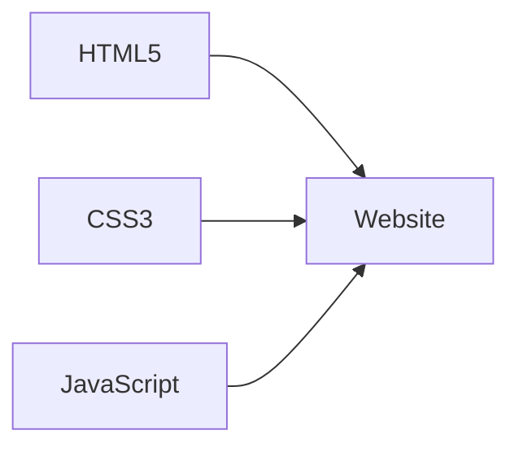

<div align="center">

# A Minimalistic Personal Website 🌐
[](https://choosealicense.com/licenses/mit/)
[](https://pages.github.com/)
[](#)


</div>

---

<table>
<tr>
<td width="33%">

## 🚀 Features

- Responsive Design
- Project Showcase
- Publication Listings
- Weekly Research Updates
- Contact Page with Google Maps Integration
- Site-wide Search

</td>
<td width="33%">

## 💻 Tech Stack



</td>


<td width="33%">

<strong>📂 File Structure</strong>

```
personal-website/
├── 📄 index.html
├── 📄 about.html
├── 📄 projects.html
├── 📄 publications.html
├── 📄 journal.html
├── 📄 contact.html
├── 🎨 styles.css
└── 🔧 common.js
```
</td>
</tr>
</table>

---

## 🚀 Quick Start

```bash
git clone https://github.com/evonshahriar/personal-website.git && cd personal-website && open index.html
```

---

<table>
<tr>
<td width="33%">

## 🛠 Customize

1. Update HTML content
2. Modify `styles.css`
3. Extend `common.js`


</td>
<td width="33%">

## 🤝 Contribute

1. Fork
2. Feature branch
3. Commit
4. Push
5. Pull request


</td>

<td width="33%">

<div align="center">

**<br><br> [](https://www.linkedin.com/in/evonshahriar/) <br> [](https://github.com/evonshahriar) <br> [](mailto:sohanmdevonshahriar@gmail.com)**


© 2024 Md Evon Shahriar Sohan 

<!---<kbd>[Support My Work](https://www.buymeacoffee.com/evonshahriar)</kbd><!---

</div>
</td>
</tr>
</table>
