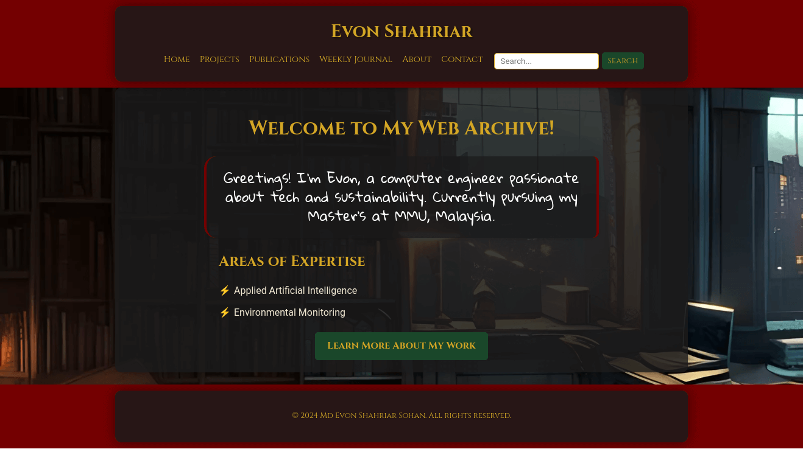

# Evon Shahriar's Personal Website 🌐
### Minimalistic Github Pages Site

[](https://choosealicense.com/licenses/mit/)
[](http://monip.org/)
[](https://github.com/evonshahriar)

Welcome to the repository for my personal website! This digital space serves as a professional portfolio showcasing my expertise in computer engineering and AI research, along with my projects, publications, and contact information.



## 📚 Table of Contents

- [Overview](#-overview)
- [Project Structure](#-project-structure)
- [Features](#-features)
- [Technologies Used](#-technologies-used)
- [Getting Started](#-getting-started)
- [Customization](#-customization)
- [Contributing](#-contributing)
- [License](#-license)

## 🌟 Overview

This website highlights my academic and professional journey, providing a platform to share my:

- Projects
- Publications
- Weekly research journal
- Contact details

It includes sections for a brief introduction, detailed background, and more.

## 📂 Project Structure

```
personal-website/
├── index.html
├── about.html
├── projects.html
├── publications.html
├── journal.html
├── contact.html
├── search.html
├── header.html
├── footer.html
├── styles.css
└── common.js
```

## 🚀 Features

- **Responsive Design**: Optimized for both desktop and mobile views
- **Accordions**: Collapsible sections for a cleaner presentation
- **Search Functionality**: Quick content discovery across the website
- **Projects and Publications**: Dedicated pages with detailed descriptions
- **Weekly Journal**: Document and share research updates
- **Contact Page**: Includes a form and Google Maps embed

## 💻 Technologies Used

- 
- 
- 
- 

## 🚀 Getting Started

1. Clone the repository:
   ```bash
   git clone https://github.com/evonshahriar/personal-website.git
   ```

2. Navigate to the project directory:
   ```bash
   cd personal-website
   ```

3. Open `index.html` in your preferred browser.

## 🎨 Customization

Make it your own:

- Update content in HTML files
- Modify `styles.css` for a unique look
- Add new sections by creating HTML files and updating `header.html`

## 🤝 Contributing

Contributions are welcome! Here's how:

1. Fork the Project
2. Create your Feature Branch (`git checkout -b feature/AmazingFeature`)
3. Commit your Changes (`git commit -m 'Add some AmazingFeature'`)
4. Push to the Branch (`git push origin feature/AmazingFeature`)
5. Open a Pull Request

## 📄 License

This project is licensed under the MIT License. See the [LICENSE](LICENSE) file for details.

---

Thank you for visiting my website repository. For questions or collaborations, feel free to [contact me](contact.html).

---

© 2024 Md Evon Shahriar Sohan. All rights reserved.

<p align="center">Made with ❤️ by Evon Shahriar</p>
